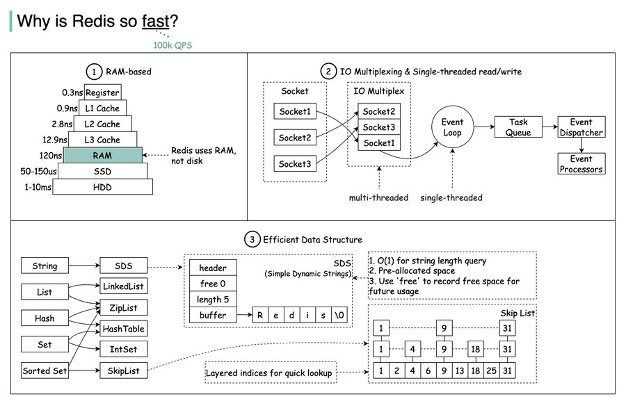

##### 2020/03/09

1. `MySQL` 索引，`LIMIT` 分页优化
2. ~~布隆过滤器~~
3. ~~`synchronized` 改变锁对象，现象验证~~: **线程到达 synchronized 代码块时，检查引用的对象地址**
4. `ReentrantReadWriteLock`
5. ~~[rocketmq-dashboard](https://github.com/apache/rocketmq-dashboard) 部署~~
6. ~~ump v6.0.0 部署~~
7. ~~`Maven` 阿里云仓库更换~~: **已更换为 https://maven.aliyun.com/repository/central**

##### 2020/03/16

1. `JVM` 加载生命周期
2. ~~`synchronized` 偏向锁~~

##### 2020/03/23

1. ~~ump v6.0.0 mtreceiver 模块逻辑~~: **已输出文档**
2. [Redis cluster](https://redis.io/docs/management/scaling/)
3. ~~`String.split()` 验证~~

##### 2020/03/30

1. [Redisson](https://redisson.org/) 编写例子运行
2. 《RocketMQ技术内幕：RocketMQ架构设计与实现原理（第2版）.pdf》阅读
3. ~~《MySQL 索引及优化实战.pdf》阅读~~: **（性能高 -> 低）explain 中的 type 是 const, ref, range, index, ALL**
4. ~~`MySQL` 是如何解决幻读的~~: **MVCC + next-key lock**

```sql
DROP TABLE IF EXISTS `dept`;
CREATE TABLE `dept`
(
    `id`   int(11) NOT NULL AUTO_INCREMENT,
    `name` VARCHAR(20) DEFAULT NULL,
    PRIMARY KEY (`id`)
) ENGINE = InnoDB DEFAULT CHARSET = utf8;
INSERT INTO dept(name)
VALUES ('后勤部');
```

|    | Session A                                                                                         | Session B                             |
|----|---------------------------------------------------------------------------------------------------|---------------------------------------|
| T1 | BEGIN;                                                                                            | BEGIN;                                |
| T2 | SELECT * FROM dept;<br/>SELECT * FROM dept LOCK IN SHARE MODE;<br/>SELECT * FROM dept FOR UPDATE; |                                       |
| T3 |                                                                                                   | INSERT INTO dept(name) VALUES('研发部'); |
| T4 |                                                                                                   | COMMIT;                               |
| T5 | SELECT * FROM dept;<br/>UPDATE dept SET name = '实验部';                                             |                                       |
| T6 | COMMIT;                                                                                           |                                       |

- 幻读标识：A 事务前后两次读，B 事务中间 insert 操作
- 幻读解决：对于**快照读**，MVCC 解决，如 T2 第 1 行 + T5 第 1 行；对于**当前读**，临键锁解决，如 T2 第 2, 3 行 + T5 第 2 行，
  此时 T3 被锁住直到 T6 结束后；对于**先快照读后当前读**，无法解决，如 T2 第 1 行 + T5 第 2 行

_临键锁加锁规则_

- 原则1：加锁的基本单位是 next-key lock，前开后闭区间。（上锁顺序先间隙锁再记录锁）
- 原则2：查找过程中访问到的对象才会加锁。（共享锁命中覆盖索引时，无须回表，可能会导致其它事务在主键加锁成功；排他锁则不会）
- 优化1：索引上的等值查询，给**唯一索引**加锁的时候，next-key lock 退化为行锁。
- 优化2：索引上的等值查询，向右遍历时且最后一个值不满足等值条件的时候，next-key lock 退化为间隙锁。
- 一个bug：**唯一索引**上的范围查询会访问到不满足条件的第一个值为止。

##### 2020/04/07

1. ~~http code 301 和 302 区别~~: **301 Permanently Moved, 302 Temporarily Moved**
2. ~~[Nginx 配置 https 证书](https://nginx.org/en/docs/http/configuring_https_servers.html)~~:

- 生成 SSL
  证书 `openssl req -x509 -nodes -days 36500 -newkey rsa:2048 -keyout /usr/nginx/nginx.key -out /usr/nginx/nginx.crt`
- 修改 _nginx.conf_ 的 http.server
  配置 `ssl_certificate /usr/nginx/nginx.crt; ssl_certificate_key /usr/nginx/nginx.key;`

##### 2020/04/26

1. `TCP` 结构
2. ~~[Wireshark](https://www.wireshark.org/) 使用~~: **抓包，看协议**
3. ~~ump v6.0.0 centrum 模块逻辑~~: **已输出文档**
4. ~~小（大）顶堆 `PriorityQueue` 使用~~: **offer() 通过 (k - 1) >>> 1 找到 parent, poll() 通过 (k << 1) + 1 + 1 找到左右
   child; {@see #siftUp #siftDown}**

##### 2020/05/06

1. [Netty](https://netty.io/) pineline 分析

##### 2020/05/25

1. ~~`CyclicBarrier, CountDownLatch, Semaphore` 底层研究~~: **CyclicBarrier 使用了 #breakBarrier 和 #nextGeneration，没有使用
   AQS**

##### 2020/06/15

###### JVM 专场

1. 介绍下垃圾收集机制（在什么时候，对什么，做了什么）
2. ~~垃圾收集有哪些算法，各自的特点~~
3. ~~类加载的过程~~: **1.加载(Loading)读二进制字节流 2.验证(Verification)魔数版本号 3.准备(Preparation)静态成员赋零值
   4.解析(Resolution)常量池中符号引用->直接引用 5.初始化(Initialization)执行 `<clinit>()` 5种时机 6.使用(Using) 7.卸载(
   Unloading)**
4. ~~双亲委派模型~~: **`ClassLoader#loadClass`
   如果一个类加载器收到了类加载的请求，它首先不会自己去尝试加载这个类，而是把这个请求委派给父类加载器去完成，因此所有的加载请求最终都应该传送到顶层的启动类加载器中，只有当父加载器反馈自己无法完成这个加载请求（找不到所需的类）时，子加载器才会尝试自己去加载。像 `java.lang.Object`
   这些存放在 rt.jar
   中的类，无论使用哪个类加载器加载，最终都会委派给最顶端的启动类加载器加载，从而使得不同加载器加载的 `Object`
   类都是同一个。相反，如果没有使用双亲委派模型，由各个类加载器自行去加载的话，如果用户自己编写了一个称为 `java.lang.Object`
   的类，并放在 classpath 下，那么系统将会出现多个不同的 `Object` 类，Java 类型体系中最基础的行为也就无法保证。**
5. ~~有哪些类加载器~~: **启动类加载器 `Bootstrap ClassLoader`，扩展类加载器 `Extension ClassLoader`
   ，应用程序类加载器 `Application ClassLoader`，自定义类加载器**

##### 2020/06/29

1. ~~[tcpdump](https://www.tcpdump.org/) 使用~~:

- 安装前置依赖包 `yum flex bison, make libpcap, make tcpdump`
- 抓包 `tcpdump -i eth0 host vm0.yejh.cn -w a.pcapng`
- 使用 Wireshark 打开文件

##### 2020/09/07

1. ~~Java 8 Lambda 闭包的理解~~: **传入参数与方法参数一致，如 `list.stream().filter(Objects::nonNull)`**

##### 2020/12/16

1. ~~[RocketMQ](https://rocketmq.apache.org/) 双主双从搭建~~:

   

?> `echo -e 'storePathRootDir=<dir>\nlistenPort=<port>\nenablePropertyFilter=<filter>' >> <file>`

```properties
# $ROCKETMQ_HOME/conf/2m-2s-async/broker-a.properties
storePathRootDir=/root/store/broker-a
listenPort=10911
enablePropertyFilter=true
# $ROCKETMQ_HOME/conf/2m-2s-async/broker-a-s.properties
storePathRootDir=/root/store/broker-a-s
listenPort=10921
enablePropertyFilter=true
# $ROCKETMQ_HOME/conf/2m-2s-async/broker-b.properties
storePathRootDir=/root/store/broker-b
listenPort=20911
enablePropertyFilter=true
# $ROCKETMQ_HOME/conf/2m-2s-async/broker-b-s.properties
storePathRootDir=/root/store/broker-b-s
listenPort=20921
enablePropertyFilter=true
```

##### 2020/12/17

1. ~~BitSet 源码分析~~: **最重要的两行代码**

```java
/**
 * {@see #set}
 */
words[wordIndex] |= (1L << bitIndex); // Restores invariants
/**
 * {@see #clear}
 */
words[wordIndex] &= ~(1L << bitIndex);
```

##### 2021/01/06

1. ~~MySQL 死锁分析~~: **DELETE IN (主键)
   ，会自动排序，但产生间隙锁 `SHOW ENGINE INNODB STATUS;`，`SELECT * FROM INFORMATION_SCHEMA.INNODB_TRX;`**

##### 2021/01/07

1. ~~try-with-resource 语法糖分析~~: **构建三层 try-catch 块，位置分别是 ①创建对象 ②业务逻辑 ③对象.close()；当 ②, ③
   都出现异常时，使用 `Throwable#addSuppressed` 抑制异常**

##### 2021/01/18

1. ~~Redis 批量删除 50W key 使用什么命令~~:

- xargs `redis-cli KEYS '*' | xargs redis-cli DEL`
- Lua
  EVAL `redis-cli EVAL "local keys = redis.call('keys', ARGV[1]) for i=1,#keys,5000 do redis.call('del', unpack(keys, i, math.min(i+4999, #keys))) end return #keys" 0 '*'`

##### 2021/03/14

1. ~~Redis 数据类型 -> 结构对应关系~~: **string -> SDS, list -> 链表 + 压缩列表, set -> 整数集合 + 字典, map ->
   压缩列表 + 字典, zset -> 压缩列表 + 跳跃表**
   

##### 2021/03/15

1. ~~InnoDB 意向锁~~:

| 锁类型 | X | IX | IS | S |
|-----|---|----|----|---|
| X   | ✖ | ✖  | ✖  | ✖ |
| IX  | ✖ | ✔  | ✔  | ✖ |
| IS  | ✖ | ✔  | ✔  | ✔ |
| S   | ✖ | ✖  | ✔  | ✔ |

- InnoDB 支持多粒度锁，特定场景下，行级锁可以与表级锁共存
- 意向锁之间互不排斥，但除了 IS 与 S 兼容外，意向锁会与 共享锁 / 排他锁 互斥
- IX，IS 是表级锁，不会和行级的 X，S 锁发生冲突。只会和表级的 X，S 发生冲突。
- 意向锁在保证并发性的前提下，实现了行锁和表锁共存且满足事务隔离性的要求。

2. ~~MyISAM 和 InnoDB 区别~~:

- InnoDB 支持事务，MyISAM 不支持事务。这是 MySQL 将默认存储引擎从 MyISAM 变成 InnoDB 的重要原因之一
- InnoDB 支持外键，而 MyISAM 不支持。对一个包含外键的 InnoDB 表转为 MYISAM 会失败
- InnoDB 是聚集索引，MyISAM 是非聚集索引。聚簇索引的文件存放在主键索引的叶子节点上，因此 InnoDB
  必须要有主键，通过主键索引效率很高。但是辅助索引需要两次查询，先查询到主键，然后再通过主键查询到数据。因此，主键不应该过大，因为主键太大，其他索引也都会很大。而
  MyISAM 是非聚集索引，数据文件是分离的，索引保存的是数据文件的指针。主键索引和辅助索引是独立的
- InnoDB 不保存表的具体行数，执行 `SELECT COUNT(*) FROM table` 时需要全表扫描。而 MyISAM
  用一个变量保存了整个表的行数，执行上述语句时只需要读出该变量即可，速度很快
- InnoDB 最小的锁粒度是行锁，MyISAM 最小的锁粒度是表锁。一个更新语句会锁住整张表，导致其他查询和更新都会被阻塞，因此并发访问受限。这也是
  MySQL 将默认存储引擎从 MyISAM 变成 InnoDB 的重要原因之一

##### 2021/03/16

1. ~~Redis 队列注意事项~~: **RPOPLPUSH 做 ACK 机制，防止丢消息；BLPOP | BRPOP 带时延阻塞，支持查询多个 list**

2. [Spring](https://spring.io/) 为什么用三级缓存

3. ~~海量数据处理解决方案~~: **①Hash 后分治 ②大小顶堆（PriorityQueue） ③位图法（BitSet） ④前缀树**

##### 2021/03/17

1. ~~[ZooKeeper](https://zookeeper.apache.org/) 选举~~

##### 2023/01/16

1. ~~[docsify](https://docsify.js.org/) 构建在线 GitPage~~

##### 2023/01/17

1. [Protocol Buffers](https://developers.google.com/protocol-buffers) 跨语言联调

##### 2023/01/18

1. 了解 [Raft](https://raft.github.io/) 共识算法
2. [Disruptor](https://github.com/LMAX-Exchange/disruptor) 初探

##### 2023/02/05

1. ~~实现归并排序~~: **类比把两个有序链表合并成总的有序链表来理解**

```java
int[] tempArr = new int[max - min + 1];
int tempIdx = 0;

int p = min;
int q = mid + 1;
while (p <= mid && q <= max) {
    if (arr[p] <= arr[q]) {
        tempArr[tempIdx++] = arr[p++];
    } else {
        tempArr[tempIdx++] = arr[q++];
    }
}
while (p <= mid) {
    tempArr[tempIdx++] = arr[p++];
}
while (q <= max) {
    tempArr[tempIdx++] = arr[q++];
}

for (int i = 0, len = tempArr.length; i < len; i++) {
    arr[i + min] = tempArr[i];
}
```

##### 2023/02/07

1. ~~[ZooKeeper](https://zookeeper.apache.org/) 学习~~: **数据结构类似文件树状；Zookeeper 和 Curator 的 API 使用**

- 创建临时顺序节点：`create -s -e path data` -s 代表顺序节点，-e 代表临时节点；临时节点不能再创建子节点；session 关闭，临时节点清除
- 实现乐观锁：`set path data version` 版本号一致才能成功设置
- 实现共享锁：`/shared_lock/vm5.yejh.cn-R-0000000001, /shared_lock/vm6.yejh.cn-W-0000000002 ...` 创建**临时**顺序节点；
  **读请求**如果所有比自己小的子节点都是读请求或者没有比自己序号小的子节点，表明成功获取共享锁，如果没有获取到共享锁，向比自己序号小的最后一个写请求节点注册
  watcher 监听；**写请求**如果自己不是序号最小的子节点，那么就进入等待，如果没有获取到共享锁，向比自己序号小的最后一个节点注册
  watcher 监听。
- 实现排他锁：`/exclusive_lock/lock` 创建**临时**子节点，最终只有一个客户端能创建成功。所有没有获取到锁的客户端可以在
  /exclusive_lock 节点上注册一个子节点变更的 watcher 监听事件，以便重新争取获得锁。

##### 2023/02/08

1. ~~ZooKeeper 迁移实操~~: **每次 start|restart|stop 后，都要用四字命令和 status 查看各节点能否对外服务，master 是否唯一**

- `vm1(123), vm2(123), vm3(123)` 顺序 `start` 稳定运行，此时 master = vm2;
- `vm4(1234), vm5(12345), vm6(123456)` 顺序 `start`，此时 master = vm2;
- `vm4(123456), vm5(123456), vm1(123456), vm3(123456), vm2(123456)` 顺序 `restart`，此时 master = vm6;
- 业务修改连接串并重启，从 `vm1,vm2,vm3` 改为 `vm4,vm5,vm6`
- `vm1(123456) stop`，`vm2(23456), vm3(23456), vm4(23456), vm5(23456), vm6(23456)` 顺序 `restart`，此时 master = vm5;
- `vm2(23456) stop`，`vm3(3456), vm4(3456), vm6(3456), vm5(3456)` 顺序 `restart`，此时 master = vm6;
- `vm3(3456) stop`，`vm4(456), vm5(456), vm6(456)` 顺序 `restart`，此时 master = vm5;

##### 2023/02/09

1. ~~分布式ID~~: **①数据库主键 ②数据库号段 ③Redis `INCR` ④UUID ⑤雪花 ID**

```sql
②数据库号段
UPDATE sequence_id_generator
SET current_max_id = 0 + 100,
    version        = version + 1
WHERE version = 0;

SELECT current_max_id, step, version
FROM sequence_id_generator;
```

- 全局唯一：ID 的全局唯一性肯定是首先要满足的
- 高性能：生成速度要快，对本地资源消耗要小
- 高可用：生成 ID 的服务要保证可用性无限接近于 100%
- 方便易用：拿来即用，使用方便，快速接入
- 安全：ID 中不包含敏感信息
- 有序递增：如果要把 ID 存放在数据库的话，ID 的有序性可以提升数据库写入速度
- 有具体的业务含义：通过 ID 就能确定是哪个业务
- 独立部署：分布式系统单独有一个发号器服务，专门用来生成 ID

2. ~~分布式锁~~: **①数据库 ②Zookeeper ③Redis**

- 互斥：任意一个时刻，锁只能被一个线程持有
- 高可用：即使客户端的释放锁的代码逻辑出现问题，锁最终一定还是会被释放，不会影响其他线程对共享资源的访问
- 可重入：一个节点获取了锁之后，还可以再次获取锁

|    | 数据库                                                                       | Zookeeper                                     | Redis                             |
|----|---------------------------------------------------------------------------|-----------------------------------------------|-----------------------------------|
| 优点 | 利用唯一索引，简单暴力                                                               | 会话断开时临时节点消失，无须设置 TTL                          | 内存高，并发效率高                         |
| 缺点 | 单点故障；无失效时间；抢锁失败抛异常非阻塞；不可重入                                                | 频繁操作磁盘动态创建删除临时节点，性能开销高                        | 内存淘汰策略导致锁信息丢失                     |
| 实现 | `INSERT INTO t_lock (unique_key, msg) VALUES ('exclusive_lock', 's0-0');` | [Apache Curator](https://curator.apache.org/) | [Redisson](https://redisson.org/) |

##### 2023/02/10

1. [CAS](https://www.apereo.org/projects/cas) SSO 原理
2. Linux free 命令解析

```sh
# 4G 内存
[root@vm5 ~]# free -ht
              total        used        free      shared  buff/cache   available
Mem:          3.6Gi       367Mi       2.3Gi        16Mi       1.0Gi       3.1Gi
Swap:         3.0Gi          0B       3.0Gi
Total:        6.7Gi       367Mi       5.3Gi
[root@vm5 ~]# 
[root@vm5 ~]# free --help

Usage:
 free [options]

Options:
 -b, --bytes         show output in bytes
     --kilo          show output in kilobytes
     --mega          show output in megabytes
     --giga          show output in gigabytes
     --tera          show output in terabytes
     --peta          show output in petabytes
 -k, --kibi          show output in kibibytes
 -m, --mebi          show output in mebibytes
 -g, --gibi          show output in gibibytes
     --tebi          show output in tebibytes
     --pebi          show output in pebibytes
 -h, --human         show human-readable output
     --si            use powers of 1000 not 1024
 -l, --lohi          show detailed low and high memory statistics
 -t, --total         show total for RAM + swap
 -s N, --seconds N   repeat printing every N seconds
 -c N, --count N     repeat printing N times, then exit
 -w, --wide          wide output

     --help     display this help and exit
 -V, --version  output version information and exit

For more details see free(1).
```

##### 2023/02/12

1. ~~5 种 I/O 模型的理解~~: **①阻塞 I/O ②非阻塞 I/O ③I/O 多路复用 ④信号驱动 I/O ⑤异步 I/O**

- 阻塞 I/O：用户态检测连接可读到读完数据；线程一直阻塞
- 非阻塞 I/O：检测是否可读立刻返回，可以业务线程检测也可以交给主线程；每次检测要切换状态
- I/O 多路复用：主线程发起 select/poll/epoll 系统调用，内核态遍历（epoll 是回调）可读连接，无须频繁切换状态；读数据时复制过程阻塞
- 信号驱动 I/O：业务线程发起 sigaction 系统调用，内核回调可读连接；读数据时复制过程阻塞
- 异步 I/O：业务线程发起 aio_read 系统调用，内核找到可读连接并**主动**复制数据到用户空间，最后通知线程复制完毕

##### 2023/02/18

1. ~~[Nacos](https://nacos.io/) 接入~~: **①配置管理 ②服务发现**

   

- API 类型：更新或插入、删除、主动读、监听读

```xml
<!--依赖包-->
<artifactId>nacos-client</artifactId>
<artifactId>nacos-common</artifactId>
<artifactId>nacos-api</artifactId>
<artifactId>nacos-config-spring-boot-starter</artifactId>
<artifactId>nacos-discovery-spring-boot-starter</artifactId>
```

- 保护阈值：健康实例占比小于该值时，返回 **健康 + 非健康**
  的服务提供者集合，牺牲流量保护剩余实例 `private float protectThreshold = 0.0F;`

##### 2023/04/23

1. ~~SQL 窗口函数~~

```sql
where window_definition has the syntax

[ existing_window_name ]
[ PARTITION BY expression [, ...] ]
[ ORDER BY expression [ ASC | DESC | USING operator ] [ NULLS { FIRST | LAST } ] [, ...] ]
[ frame_clause ]
```

- 窗口函数不改变原结果集的行数，聚合函数把结果集汇总成组内一行
- 确保结果集以特定方式排序的话，不建议依赖窗口函数的排序，应使用外层的 `ORDER BY` 来控制
- PostgreSQL 排名窗口函数 **(row_number(), rank(), dense_rank(), percent_rank()...)** 遇到 NULL 值时，NULL 值当作 +∞ 来计算

##### 2023/05/28

1. ~~Redis 过期键监听实现延迟队列~~

- 中间件开启配置

```properties
#  By default all notifications are disabled because most users don't need
#  this feature and the feature has some overhead. Note that if you don't
#  specify at least one of K or E, no events will be delivered.
notify-keyspace-events Ex
```

- 获取过期事件（同时获取并删除影子键，用于获取原 value 值）

```java
@Configuration
public class RedisTemplateConfiguration {

    @Bean
    public RedisMessageListenerContainer container(RedisConnectionFactory connectionFactory) {
        RedisMessageListenerContainer container = new RedisMessageListenerContainer();
        container.setConnectionFactory(connectionFactory);
        return container;
    }
}

@Component
public class RedisKeyExpirationListener extends KeyExpirationEventMessageListener {

    public RedisKeyExpirationListener(RedisMessageListenerContainer listenerContainer) {
        super(listenerContainer);
    }

    @Override
    public void onMessage(Message message, byte[] pattern) {}
}
```

2. ~~[mapstruct](https://mapstruct.org/) 使用~~

- 添加 maven 插件（注意 `annotationProcessorPaths` 声明的顺序）

```xml

<plugin>
    <groupId>org.apache.maven.plugins</groupId>
    <artifactId>maven-compiler-plugin</artifactId>
    <version>3.8.1</version>
    <configuration>
        <source>${maven.compiler.source}</source>
        <target>${maven.compiler.target}</target>
        <encoding>${project.build.sourceEncoding}</encoding>
        <annotationProcessorPaths>
            <path>
                <groupId>org.projectlombok</groupId>
                <artifactId>lombok</artifactId>
                <version>${lombok.version}</version>
            </path>
            <path>
                <groupId>org.mapstruct</groupId>
                <artifactId>mapstruct-processor</artifactId>
                <version>${mapstruct.version}</version>
            </path>
        </annotationProcessorPaths>
    </configuration>
</plugin>
```

- 添加转换器接口

```java
@Mapper
public interface ReqEntityMapper {

    ReqEntityMapper INSTANCE = Mappers.getMapper(ReqEntityMapper.class);
}
```

##### 2023/06/18

1. ~~[EMQX](https://www.emqx.io/) MQTT 接入~~
2. ~~Spring Boot 中实现 WebSocket API~~